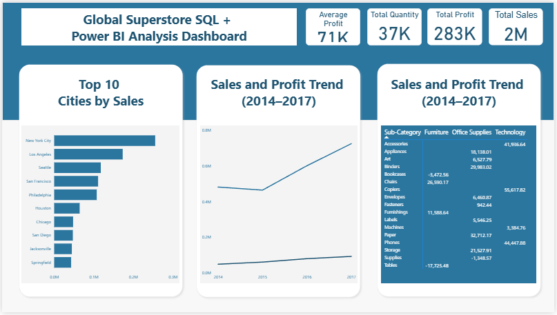

# Global Superstore - Sales & Profitability Analysis (2014–2017)

## Business Context
A global retail superstore operates across multiple regions, cities, product categories, and customer segments.
Leadership wants to understand <b>where revenue is coming from, which areas are profitable, and where hidden losses are eroding margins,</b> in order to make better decisions around pricing, assortment, and regional focus.

This analysis evaluates historical sales performance to identify growth drivers, profit leaks, and actionable opportunities for the business.

## Business Questions
- Which regions and cities drive the majority of revenue?
- Are high-sales products actually profitable, or masking losses?
- Which product sub-categories should be re-priced, optimized, or discontinued?
- How have sales and profits trended over time, and is growth sustainable?
- Where should leadership focus expansion vs cost control?

## Data Overview
- Source: Global Superstore dataset (Kaggle)
- Time Period: 2014–2017
- Granularity: Transaction-level sales data
- Key Dimensions:
  - Geography: Region, City
  - Product: Category, Sub-Category
  - Financials: Sales, Profit, Quantity

## Core Business Metrics
<table> <tr><th>Metric</th><th>Value</th><th>Why It Matters</th></tr> <tr><td>Total Sales</td><td>~$2.0M</td><td>Overall revenue scale of the business</td></tr> <tr><td>Total Profit</td><td>~$283K</td><td>Net value generated after costs</td></tr> <tr><td>Total Quantity Sold</td><td>~37K units</td><td>Demand volume across products</td></tr> <tr><td>Average Profit</td><td>~$71K</td><td>Profit consistency across transactions</td></tr> </table>

## Executive Findings
### 1. Revenue Is Concentrated in a Few Cities
- A small number of cities (New York City, Los Angeles, Seattle) account for a disproportionate share of total sales.
- Many cities contribute marginal revenue, increasing operational complexity without meaningful upside.

### 2. Sales Growth Does Not Equal Profit Growth
- Sales increased steadily from ~$480K in 2014 to ~$725K in 2017.
- Profit growth lagged behind sales, indicating margin pressure in certain product lines.

### 3. Some High-Volume Sub-Categories Are Loss-Making
- Specific sub-categories consistently generate negative profit despite healthy sales volumes.
- These losses likely stem from discounting, shipping costs, or pricing misalignment.

### 4. Category Performance Is Uneven
- Technology and select Office Supplies drive strong profitability.
- Furniture contains sub-categories that drag down overall margins.

## Business Recommendations
- Pricing & Product Strategy
- Re-price or bundle loss-making sub-categories to restore margin.
- Consider discontinuing persistently unprofitable SKUs.

## Regional Focus
- Double down on top-performing cities with targeted promotions and inventory depth.
- Reassess operational costs in low-contribution cities.

## Category Optimization
- Expand high-margin Technology products.
- Apply cost controls or vendor renegotiation in low-margin Furniture lines.

## Performance Monitoring
- Track profit trends alongside sales to avoid growth driven purely by discounting.
- Introduce profit-based KPIs at category and sub-category levels.

## Dashboard Overview

- KPI summary (Sales, Profit, Quantity)
- City-level revenue concentration
- Sales and profit trends over time
- Category and sub-category profitability comparison

## Tools & Workflow
- Excel / SQL: Data cleaning, aggregation, KPI creation
- Power BI: Executive-level dashboards and storytelling
